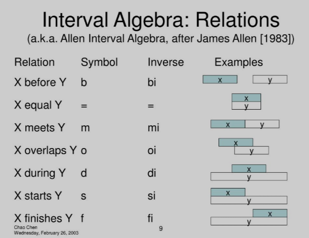

# Domain Driven Database Design in the Enterprise Architecture

## Introduction

In today's complex enterprise environments, organizations face the challenge of managing heterogeneous database systems while maintaining consistency, quality, and scalability. Domain Driven Database Design (DDDD) offers a comprehensive solution by applying Domain-Driven Design principles to database architecture. This approach creates a horizontally scalable standard that works across all ANSI SQL databases and even extends to NoSQL systems, providing a unified enterprise standard for data modeling and code generation.

## The Business Value Proposition

The implementation of Domain Driven Database Design delivers substantial quantifiable value across multiple dimensions:

### Financial Benefits
- **Development Cost Reduction**: 30-50% decrease in database development time through standardization and automation
- **Maintenance Cost Savings**: 40-60% reduction in database maintenance costs due to consistency and predictability
- **Error Resolution Efficiency**: 70% faster resolution of data-related issues through clear naming and constraint conventions
- **Reduced Technical Debt**: Systematic elimination of legacy inconsistencies reduces long-term technical debt

### Operational Benefits
- **Cross-Platform Consistency**: Single standard applicable across all database platforms reduces training and context-switching costs
- **Accelerated Development Cycles**: Standardized patterns and automated code generation enable faster development iterations
- **Improved Team Collaboration**: Common language and conventions facilitate communication between database teams, application developers, and business analysts
- **Enhanced Knowledge Transfer**: Standardized naming reduces dependency on tribal knowledge when onboarding new team members

### Strategic Benefits
- **Data as a Strategic Asset**: Properly modeled databases with business-aligned naming transform data into a strategic enterprise asset
- **Agile Adaptability**: Standardized databases are easier to modify as business requirements evolve
- **Merger & Acquisition Readiness**: Standardized database approach facilitates system integration during M&A activities
- **Regulatory Compliance**: Consistent naming and documentation simplify regulatory compliance and audits

## What is Domain Driven Database Design?

Domain Driven Database Design is an architectural approach that applies the principles of Domain-Driven Design to database development. It uses PascalCase naming conventions and a structured approach to database objects, creating a consistent, business-focused database design that serves as a centralized repository for business logic and facilitates automated code generation.

Core principles of DDDD include:

- Objects uniquely defined following standardized naming conventions
- Adherence to SOLID Design Principles and DRY (Don't Repeat Yourself)
- Database as a centralized repository for business logic
- Elimination of three-predicate logic in favor of two-predicate logic
- Automated code generation capabilities through modeling tools

## The Power of PascalCase Naming Conventions

Unlike traditional PostgreSQL snake_case conventions, DDDD employs PascalCase naming for all database objects:

| Database Object | Domain Driven Design Standard (PascalCase) |
|----------------|-------------------------------------------|
| Schema Names | "SchemaName" |
| Table Names | "SchemaName"."TableName" |
| Column Names | "ColumnName" |
| Primary Key Constraint | "PK_SchemaName_TableName" |
| Foreign Key Constraint | "FK_SchemaName_TableName_ReferencedSchemaName_ReferencedTable" |
| Check Column Constraint | "CHK_SchemaName_TableName_ColumnName" |
| Check Table Constraint | "CHK_SchemaName_TableName_TableValidationConditionName" |
| Check Database Constraint | "CHK_SchemaName_TableName_DatabaseValidationConditionName" |
| Unique Constraint | "UQ_SchemaName_TableName_ColumnName" |
| Default Constraint | "DF_SchemaName_TableName_ColumnName" |
| Index Names | "IX_SchemaName_TableName_ColumnName" |
| View Names | "SchemaName"."VW_ViewPurpose" |
| Function Names | "SchemaName"."VerbObjectQualifier" |
| Trigger Names | "TR_SchemaName_TableName_TimingAction" |
| Sequence Names | "SchemaName"."TableName_ColumnName_Seq" |
| Materialized View | "SchemaName"."MV_ViewPurpose" |
| Enum Type | "SchemaName"."TypeNameType" |
| Domain Type | "SchemaName"."DomainPurposeDomain" |
| Composite Type | "SchemaName"."TypePurposeType" |
| Partition Table | "SchemaName"."ParentTable_PartitionKey" |
| Temporary Table | "SchemaName"."Tmp_Purpose" |
| Audit Table | "SchemaName"."TableName_Audit" |
| Junction Table | "SchemaName"."Table1Table2" |
| Association Table | "SchemaName"."Table1Table2" |

## Implementation Example

```sql
-- Domain-Driven Design (PascalCase)
CREATE SCHEMA "Inventory";

CREATE TABLE "Inventory"."Product" (
    "Id" int GENERATED ALWAYS AS IDENTITY,
    "ProductCode" varchar(50) NOT NULL,
    "Name" varchar(100) NOT NULL,
    "Description" text NOT NULL CONSTRAINT "DF_Inventory_Product_Description" DEFAULT 'No Description',
    "UnitPrice" numeric(10,2) NOT NULL,
    "CreatedAt" timestamp NOT NULL CONSTRAINT "DF_Inventory_Product_CreatedAt" DEFAULT now(),
    "UpdatedAt" timestamp NOT NULL CONSTRAINT "DF_Inventory_Product_UpdatedAt" DEFAULT now(),
    CONSTRAINT "PK_Inventory_Product" PRIMARY KEY ("Id"),
    CONSTRAINT "UQ_Inventory_Product_ProductCode" UNIQUE ("ProductCode"),
    CONSTRAINT "CHK_Inventory_Product_Description" CHECK ("Description" <> NULL)
);

CREATE INDEX "IX_Inventory_Product_Name" ON "Inventory"."Product"("Name");
```

Notice how in the Domain-Driven Design example, the Description field has both a meaningful default value ('No Description') and a check constraint to ensure it's not NULL, eliminating the three-state logic problem and enforcing data integrity according to domain rules.

## Data Quality Challenges and Solutions

### The Three-Predicate Logic Problem

Traditional database designs suffer from three-predicate logic problems, where data can exist in three states:
1. NULL (no value)
2. Empty value (e.g., empty string, zero)
3. Meaningful value

This creates numerous challenges:
- Inconsistent validation across application layers
- Complex query conditions to handle NULL cases
- Difficulty in enforcing business rules
- Ambiguity in data interpretation

### Eliminating Three-Predicate Logic

A key advantage of DDDD is the elimination of three-predicate logic in favor of two-predicate logic (default, value). This is achieved through:

1. Making columns NOT NULL with meaningful defaults
2. Adding CHECK constraints to validate values
3. Ensuring consistency between database and application logic

This approach simplifies data validation and business rules by removing NULL consideration and focusing only on whether a value is default or meaningful.

### Beyond Data-Only Quality Assessment

Traditional data quality approaches focus solely on analyzing existing data, which has several limitations:
- Remediation is reactive rather than preventive
- Root causes in the data model remain unaddressed
- Quality rules exist separately from the database definition
- Lack of integration between metadata and data quality

DDDD takes a holistic approach by:
1. **Integrating Metadata and Data Analysis**: Combining database structure analysis with data quality assessment
2. **Model-Driven Quality**: Identifying patterns in the data that suggest model deficiencies
3. **Structural Recommendations**: Generating specific data model improvement recommendations

### Forward Engineering Quality Solutions

The DDDD approach enables a structured process for continuous data quality improvement:

1. **Quality Pattern Detection**: Automated analysis identifies data patterns indicating model issues (e.g., high occurrence of specific default values suggesting missing categorization)
2. **Model Correction Recommendations**: Generation of specific model enhancements (e.g., creating a lookup table, adding constraints)
3. **Forward Engineering**: Automatically generating the SQL scripts to implement model corrections
4. **Data Migration Planning**: Creating data transformation scripts to normalize existing data to the new model
5. **Validation Rules Synchronization**: Ensuring all application layers enforce the same rules as the database

## Temporal Data Management in DDDD

### Beyond Traditional Temporal Tables

While standard database temporal tables provide basic point-in-time capabilities, Domain Driven Database Design takes temporal data management to a more sophisticated level by incorporating Allen's Interval Algebra, providing richer semantics for temporal relationships.

### Allen's Interval Algebra: A Foundation for Temporal Reasoning

Allen's Interval Algebra identifies 13 distinct temporal relationships between time intervals, providing a comprehensive framework for modeling temporal data.

| Relation | Symbol | Converse | Symbol | Description |
|----------|--------|----------|--------|-------------|
| precedes | p | preceded by | P | Interval A ends before interval B starts |
| meets | m | met by | M | Interval A ends exactly when interval B starts |
| overlaps | o | overlapped by | O | Interval A starts before B, ends during B |
| finished by | F | finishes | f | Interval A starts before B, both end together |
| contains | D | during | d | Interval A completely contains interval B |
| starts | s | started by | S | Both intervals start together, A ends before B |
| equals | e | equals | e | Both intervals are identical |



This algebra provides a precise vocabulary for characterizing temporal relationships, regardless of whether the intervals are definite (exact endpoints) or indefinite (approximate endpoints).

### Temporal Referential Integrity Using Allen's Intervals

DDDD extends traditional referential integrity to include temporal dimensions using Allen's relations. This approach allows for sophisticated temporal constraints such as:

- Ensuring employment periods fall within an employee's tenure
- Preventing overlapping assignments for the same employee
- Validating that project assignments don't exceed project lifetimes
- Enforcing sequential dependencies between related activities

### Advantages Over Standard Temporal Tables

Allen's Interval Algebra integration in DDDD offers several advantages over standard temporal tables:

1. **Richer Semantics**: Expresses complex temporal relationships beyond simple "valid from/to" ranges
2. **Flexible Constraints**: Defines precise temporal integrity rules using Allen's relations
3. **Query Simplification**: Provides functions that simplify temporal queries
4. **Cross-Platform Consistency**: Implements consistent temporal logic across database platforms
5. **Domain Alignment**: Maps more naturally to business temporal concepts

### Temporal Metadata Management

DDDD also standardizes the metadata for temporal information through views that enable:
- Documentation of temporal relationship semantics
- Analysis of temporal dependencies
- Validation of temporal integrity rules
- Generation of temporal query templates

## System Catalog Integration: The Metadata Schema

A cornerstone of effective Domain Driven Database Design implementation is the creation of a standardized "Metadata" schema that serves as a platform-independent layer for accessing system catalog information.

### The Power of Standardized Metadata

The system catalog in each database platform (PostgreSQL's pg_catalog, SQL Server's sys schema, Oracle's data dictionary views) contains valuable information about database objects, but each platform organizes this information differently. DDDD addresses this by creating a consistent interface through the "Metadata" schema:

```sql
CREATE SCHEMA "Metadata";
```

Within this schema, views and functions are created that query the native system catalog but present the information in a standardized format:

```sql
-- PostgreSQL implementation example
CREATE VIEW "Metadata"."TableDefinition" AS
SELECT
    n.nspname AS "SchemaName",
    c.relname AS "TableName",
    obj_description(c.oid) AS "TableDescription",
    -- Additional standardized fields
FROM pg_class c
JOIN pg_namespace n ON n.oid = c.relnamespace
WHERE c.relkind = 'r';

-- For column information
CREATE VIEW "Metadata"."ColumnDefinition" AS
SELECT
    n.nspname AS "SchemaName",
    c.relname AS "TableName",
    a.attname AS "ColumnName",
    pg_catalog.format_type(a.atttypid, a.atttypmod) AS "DataType",
    a.attnotnull AS "IsRequired",
    -- Additional standardized fields
FROM pg_attribute a
JOIN pg_class c ON c.oid = a.attrelid
JOIN pg_namespace n ON n.oid = c.relnamespace
WHERE a.attnum > 0 AND NOT a.attisdropped;
```

Equivalent views would be created for SQL Server, Oracle, MySQL, and other supported platforms, each using the native system catalog tables but presenting a consistent interface.

### Practical Applications of Metadata Views

These standardized metadata views enable powerful capabilities:

1. **Automated Documentation Generation**
   - Generate consistent documentation across platforms
   - Create data dictionaries from live database structures
   - Document relationships and dependencies

2. **Code Generation Templates**
   - Create platform-agnostic templates that work with any database
   - Generate consistent DDL scripts across platforms
   - Facilitate database migrations between platforms

3. **Schema Comparison and Validation**
   - Compare schema versions to identify differences
   - Validate implementation against design
   - Identify unauthorized schema changes

4. **Metadata-Driven Application Features**
   - Dynamic form generation based on table structure
   - Automatic CRUD operations across database platforms
   - Intelligent search capabilities across database objects

### Metadata-Based Quality Assessment

The "Metadata" schema also enables advanced quality assessment capabilities:

```sql
-- Column null usage analysis
CREATE VIEW "Metadata"."ColumnNullAnalysis" AS
SELECT
    "SchemaName",
    "TableName",
    "ColumnName",
    "DataType",
    "IsRequired",
    "TotalRows",
    "NullCount",
    "NullPercentage",
    CASE
        WHEN "NullPercentage" > 90 THEN 'Consider making NOT NULL with default'
        WHEN "NullPercentage" > 50 THEN 'Review business rules'
        WHEN "NullPercentage" < 1 THEN 'Consider making NOT NULL'
        ELSE 'Acceptable'
    END AS "Recommendation"
FROM "Metadata"."ColumnStatistics";
```

This view combines metadata with actual data statistics to provide actionable recommendations for schema improvements.

### Cross-Database Consistency Functions

The "Metadata" schema can also include functions that help maintain consistency across databases:

```sql
-- Function to generate standardized constraint names
CREATE OR REPLACE FUNCTION "Metadata"."GenerateConstraintName"(
    "ConstraintType" varchar,
    "SchemaName" varchar,
    "TableName" varchar,
    "ColumnNames" varchar[]
) RETURNS varchar AS $$
-- Logic to generate constraint names following DDDD conventions
$$ LANGUAGE plpgsql;
```

These functions ensure naming conventions are followed consistently, even when developers are manually creating database objects.

## Enterprise Architecture Integration

### Domain Driven Database Design in the Enterprise Architecture

DDDD is not just a database design approach—it's a critical component of a comprehensive enterprise architecture strategy. By integrating DDDD with other architectural practices, organizations can achieve greater consistency, traceability, and alignment between business domains and technical implementations.

### Domain Driven Design (DDD) Alignment

DDDD complements traditional Domain Driven Design by:

1. **Ubiquitous Language Reinforcement**: The PascalCase naming conventions directly reflect the business domain's ubiquitous language in the database layer
2. **Bounded Context Mapping**: Database schemas align with bounded contexts in the domain model
3. **Aggregate Root Representation**: Tables directly map to aggregate roots in the domain model
4. **Value Object Implementation**: Using custom types and domains to represent value objects
5. **Repository Pattern Support**: Standardized database interfaces that map cleanly to repository implementations

### Enterprise Data Governance Enhancement

DDDD strengthens data governance through:

1. **Clear Ownership**: Each database object has clear ownership through schema qualification
2. **Consistent Naming**: Standardized naming simplifies data governance policies
3. **Metadata Integration**: Rich metadata facilitates data cataloging and lineage tracking
4. **Validation Standards**: Consistent implementation of data quality rules
5. **Audit Capabilities**: Standardized audit mechanisms across databases

### Microservice Architecture Support

For organizations adopting microservice architectures, DDDD provides:

1. **Service Boundary Alignment**: Database schemas align with microservice boundaries
2. **Consistent Data Contracts**: Standardized naming across services facilitates integration
3. **Schema Evolution Patterns**: Clear conventions for managing schema changes
4. **Polyglot Persistence Support**: Consistent naming across different database technologies

### API-First Strategy Enablement

DDDD enables API-first strategies by:

1. **Consistent Resource Naming**: Database object names map cleanly to API resource names
2. **Data Contract Alignment**: Database constraints become API validation rules
3. **Versioning Support**: Clear patterns for managing database changes alongside API versions
4. **Automated API Generation**: Database objects can drive automated API generation

### DataOps and DevOps Integration

DDDD facilitates modern DataOps and DevOps practices:

1. **Infrastructure as Code**: Database definitions expressed in standardized, versionable DDL
2. **Automated Testing**: Consistent naming enables standardized test frameworks
3. **Continuous Integration**: Database changes can be automatically validated against conventions
4. **Deployment Automation**: Standardized scripts for database deployment across environments
5. **Monitoring Integration**: Consistent object naming simplifies database monitoring

## Case Studies: Domain Driven Database Design in Action

### Enterprise Validation Framework

A financial services organization implemented a comprehensive validation framework using DDDD principles in their Erwin data modeling environment. The validation system was designed to:

1. Define business rules at the conceptual model level
2. Translate these rules to appropriate constraints in the logical model
3. Generate platform-specific constraints in the physical model
4. Forward-engineer validation rules to multiple database platforms

Their validation framework included:

- **Domain-level validations**: Standard types like email addresses, phone numbers, and postal codes
- **Entity-level validations**: Business rules specific to individual entities
- **Relationship validations**: Complex referential integrity rules
- **Cross-entity validations**: Rules spanning multiple entities

The validation rules were maintained in the data modeling tool and automatically propagated to all supported database platforms, ensuring consistent implementation of business rules across the enterprise.

### Custom Audit Framework Implementation

A healthcare organization implemented a reusable audit framework using DDDD principles. Their approach:

1. Created a standardized audit table structure following DDDD naming conventions
2. Developed reusable trigger templates customized for each database platform
3. Implemented automation to generate audit objects for any table
4. Maintained consistent behavior across PostgreSQL, SQL Server, and Oracle databases

The audit system captured:
- Who made changes (user identification)
- When changes occurred (timestamp)
- What changed (before and after values)
- Why changes were made (reason codes)
- How changes were made (application context)

This standardized approach significantly reduced development time while ensuring comprehensive audit capabilities across their heterogeneous database environment.

### Cross-Platform Implementation Success

A manufacturing company with a diverse technology stack implemented DDDD across their database platforms:

1. PostgreSQL for operational systems
2. SQL Server for data warehousing
3. Oracle for legacy ERP integration
4. MongoDB for document storage

By implementing DDDD standards:
- Development teams could move between projects on different platforms with minimal retraining
- Documentation remained consistent regardless of the underlying platform
- Code generation templates worked across all SQL databases with minimal customization
- System integration became simpler due to consistent naming and structure

The organization reported a 45% reduction in cross-platform development time and a 60% decrease in integration issues following DDDD implementation.

### Architecture Modernization

A government agency used DDDD as the foundation for modernizing their database architecture:

1. Created a comprehensive inventory of existing database assets
2. Developed a standardized DDDD-based data model in Erwin
3. Established automated mapping between legacy naming and DDDD conventions
4. Implemented incremental modernization with each new feature

Their modernization journey included:
- Automated generation of standardized views over legacy structures
- Gradual retirement of legacy naming as systems were updated
- Consistent naming in all new development
- Improved documentation and knowledge transfer

After 18 months, 60% of their active development was on DDDD-standard databases, with legacy systems accessed through standardized views until they could be fully converted.

## Comprehensive Code Generation

### 3. Comprehensive Automated Code Generation

With proper modeling tools like Erwin DM and Embarcadero, DDDD enables a complete code generation ecosystem:

#### Database Layer
- DDL scripts for multiple database platforms from a single model
- Migration scripts for schema evolution
- Custom constraint generation
- Stored procedure and function code
- Trigger-based auditing systems
- Database documentation

#### Business Logic Layer (BLL)
- Repository pattern implementations
- Service layer interfaces and implementations
- Domain entity models
- Validation rule enforcement
- Transaction management
- Data access objects (DAOs)
- ORM mappings (Hibernate, Entity Framework, etc.)

#### API Layer
- RESTful API endpoints
- GraphQL schema definitions
- API documentation (Swagger/OpenAPI)
- Authentication and authorization templates
- Input validation
- Error handling

#### Python-Specific Generation
- Pydantic V2 data models with validation
- SQLAlchemy ORM models
- FastAPI endpoint definitions
- Database connection and pooling management
- Data transformation utilities
- Unit test templates

#### Frontend Scaffolding
- Form templates based on entity definitions
- UI component definitions
- Validation rule implementation
- State management scaffolding

This comprehensive code generation approach ensures:
1. Consistency across all application layers
2. Automatic propagation of model changes
3. Enforcement of business rules at all levels
4. Significant development time reduction
5. Reduced risk of implementation errors

The code generation templates are customizable to match your organization's specific coding standards and architectural patterns, allowing for consistent implementation across diverse technology stacks.

## Tools and Technologies: DDDD Implementation

### Data Modeling Tools

To fully implement Domain Driven Database Design, organizations need robust data modeling tools that support customizable naming conventions and multi-platform code generation:

#### Erwin Data Modeler

Erwin DM offers powerful capabilities for DDDD implementation:

- **Complete Customization**: Define custom naming templates for all database objects
- **Multi-Platform Support**: Generate DDL for various database platforms from a single model
- **Validation Rules**: Define and implement complex validation rules
- **Forward and Reverse Engineering**: Synchronize models with existing databases
- **Template-Based Generation**: Create custom templates for code generation
- **Metadata Integration**: Import and analyze system catalog information
- **Naming Standards Enforcement**: Validate object names against DDDD standards

The tool can be configured to enforce DDDD naming conventions automatically, ensuring consistency across all database development.

#### Embarcadero ER/Studio

Embarcadero ER/Studio provides complementary capabilities:

- **Universal Naming Convention Templates**: Define organization-wide naming standards
- **Cross-Platform Generation**: Support for multiple database platforms
- **Data Dictionary Integration**: Maintain comprehensive metadata
- **Business Rule Repository**: Centralized definition of validation rules
- **Compare and Merge**: Identify differences between model versions or environments
- **Repository-Based Collaboration**: Team-based modeling with version control
- **Sub-model Creation**: Create domain-specific views of the enterprise model

### Custom Code Generation

Both tools support custom code generation capabilities that extend beyond basic DDL:

1. **Python Code Generation**
   - Pydantic V2 models with validation rules derived from database constraints
   - SQLAlchemy ORM classes aligned with database structure
   - FastAPI endpoint definitions based on entity relationships
   - Data access layer implementations

2. **Business Logic Layer Generation**
   - Service interfaces and implementations
   - Repository pattern templates
   - Domain entity definitions
   - Validation rule enforcement

3. **Documentation Generation**
   - Markdown-based documentation
   - HTML data dictionaries
   - Interactive schema visualizations
   - Validation rule catalogs

### Integration with DevOps Pipelines

DDDD implementation can be integrated with modern DevOps practices:

- **Database CI/CD**: Automated testing and deployment of database changes
- **Schema Validation**: Automated validation of database deployments against DDDD standards
- **Migration Generation**: Automatic creation of migration scripts
- **Drift Detection**: Identification of unauthorized schema changes
- **Version Control Integration**: Storage of database definition in Git repositories

### Real-Time Collaboration

Modern implementations of DDDD leverage real-time collaboration tools:

- **Shared Repositories**: Central storage of data models
- **Collaborative Editing**: Multi-user model development
- **Version Control**: Tracking changes to data models
- **Review Workflows**: Formal review of proposed changes
- **Impact Analysis**: Assessment of downstream effects of model changes

## Future Directions: AI-Enhanced Domain Driven Database Design

As Domain Driven Database Design matures within an enterprise, AI capabilities can significantly enhance its implementation and evolution:

### Automated Domain Discovery

AI systems can analyze existing database schemas across the enterprise to:
- Identify common domain concepts across applications
- Detect inconsistent naming of similar entities
- Recommend standardized names for domain objects
- Generate domain glossaries from existing database assets

### Intelligent Code Generation

AI-enhanced code generation can:
- Learn from existing code patterns to improve templates
- Suggest optimizations for generated code
- Adapt to platform-specific best practices
- Create comprehensive test coverage for generated components

### Natural Language Schema Design

Advanced NLP techniques enable:
- Generating database schemas from business requirements documents
- Translating user stories into database objects
- Creating validation rules from natural language specifications
- Detecting potential integrity issues in requirements

### Anomaly Detection

AI analysis can enhance data quality through:
- Identifying patterns suggesting data model deficiencies
- Detecting constraints that should be implemented
- Recommending schema optimizations based on usage patterns
- Highlighting potential data integrity issues

### Metadata Intelligence

AI can enhance metadata management by:
- Suggesting appropriate documentation for database objects
- Correlating database structures with business processes
- Identifying relationships between disparate data domains
- Recommending data governance policies

### Predictive Schema Evolution

Advanced analytics can support schema evolution by:
- Predicting impact of proposed changes
- Recommending phased implementation approaches
- Identifying optimal timing for schema modifications
- Forecasting capacity needs based on data growth patterns

This AI-augmented approach to DDDD represents the next frontier, where machine learning enhances human expertise to create truly intelligent database architectures that continuously evolve with the business domain.

## Implementation Strategy: A Phased Approach

Domain Driven Database Design implementation requires a thoughtful, phased approach to ensure successful adoption across the enterprise. The following roadmap outlines key activities without specific timelines, allowing organizations to adapt the pace to their specific circumstances:

### Phase 1: Foundation Building

1. **Standards Development**
   * Define PascalCase naming conventions for all database objects
   * Document standards in a centralized repository
   * Create examples for each database platform
   * Develop validation rules for naming conventions

2. **Tool Configuration**
   * Configure data modeling tools (Erwin DM, Embarcadero)
   * Create custom forward engineering templates
   * Implement naming standards validation
   * Develop model-to-code generation templates

3. **Training and Awareness**
   * Train database developers and architects
   * Educate application developers on new standards
   * Create quick reference guides for naming conventions
   * Develop case studies demonstrating benefits

### Phase 2: Pilot Implementation

1. **Select Pilot Project**
   * Choose a new development project or bounded context
   * Define success metrics for the pilot
   * Assemble a cross-functional implementation team
   * Create a detailed implementation plan

2. **Implement Core Components**
   * Create "Metadata" schema with system catalog views
   * Develop standard functions and stored procedures
   * Implement audit framework templates
   * Create validation functions and constraints

3. **Measure and Refine**
   * Collect metrics on development efficiency
   * Gather feedback from development teams
   * Refine standards based on implementation experience
   * Document lessons learned for broader rollout

### Phase 3: Enterprise Expansion

1. **Standards Governance**
   * Establish standards committee
   * Create formal change management process
   * Develop compliance measurement tools
   * Integrate with enterprise architecture governance

2. **Legacy System Integration Strategy**
   * Inventory existing database assets
   * Prioritize systems for standardization
   * Develop transformation approaches (wrapper views, gradual refactoring)
   * Create migration utility tools

3. **Cross-Platform Implementation**
   * Extend implementation to all database platforms
   * Ensure consistency across heterogeneous environments
   * Develop cross-platform testing frameworks
   * Create platform-specific implementation guides

### Phase 4: Advanced Capabilities

1. **Advanced Code Generation**
   * Develop Pydantic V2 model generation templates
   * Create Business Logic Layer code generators
   * Implement API definition generators
   * Build frontend scaffolding generators

2. **Temporal Framework Implementation**
   * Implement Allen's Interval Algebra functions
   * Create temporal constraint templates
   * Develop temporal query functions
   * Build temporal metadata views

3. **Integration with Enterprise Systems**
   * Connect with master data management platforms
   * Integrate with data catalog solutions
   * Link with enterprise data governance tools
   * Align with API management systems

### Phase 5: Continuous Evolution

1. **Metrics and Monitoring**
   * Track adoption across the enterprise
   * Measure impact on development efficiency
   * Monitor data quality improvements
   * Assess maintenance cost reductions

2. **Knowledge Sharing**
   * Document success stories and case studies
   * Create comprehensive training programs
   * Develop mentorship opportunities
   * Build communities of practice

3. **Standards Evolution**
   * Regular review and refinement of standards
   * Technology horizon scanning for new capabilities
   * Integration with emerging database technologies
   * Adaptation to evolving business needs

## Conclusion

Domain Driven Database Design represents a paradigm shift in enterprise architecture, transforming how organizations approach database development across heterogeneous environments. By applying Domain-Driven Design principles to database architecture, DDDD creates a unified standard that spans all database platforms while directly reflecting business domain concepts.

The implementation of PascalCase naming conventions provides immediate visual identification of object types and relationships, while the elimination of three-predicate logic in favor of two-predicate logic simplifies data validation and improves data quality. The standardized "Metadata" schema delivers consistent access to system catalog information across different database platforms, enabling powerful cross-platform development capabilities.

The integration of Allen's Interval Algebra extends DDDD's capabilities beyond traditional temporal tables, providing richer semantics for time-based relationships that accurately reflect complex business rules. This advanced approach to temporal modeling allows organizations to implement sophisticated time-based constraints that traditional database designs struggle to express.

As AI capabilities evolve, Domain Driven Database Design will be further enhanced through automated domain discovery, intelligent code generation, and predictive schema evolution. These AI-augmented approaches represent the next frontier in database architecture, where machine learning enhances human expertise to create truly intelligent database systems that continuously evolve with the business domain.

By embracing DDDD, organizations can achieve not just technical excellence in database design, but true alignment between technology implementation and business domains—the ultimate goal of enterprise architecture. The result is reduced development time, improved data quality, simplified maintenance, and databases that genuinely serve as strategic business assets rather than technical liabilities.

The journey to implementing Domain Driven Database Design may be undertaken in phases, allowing organizations to demonstrate value at each stage while building toward a comprehensive implementation. This evolutionary approach ensures that DDDD becomes embedded in the organization's development culture, delivering increasing returns as adoption expands across the enterprise.